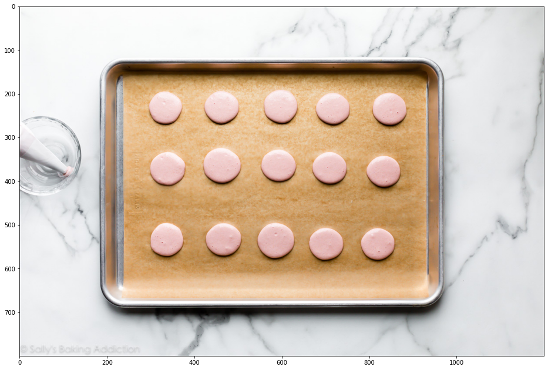
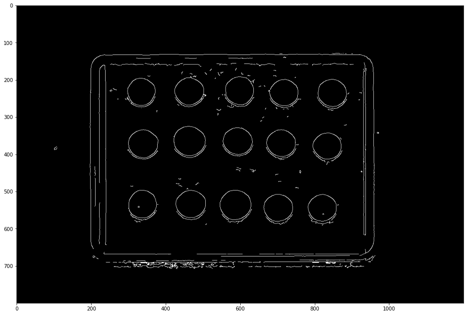
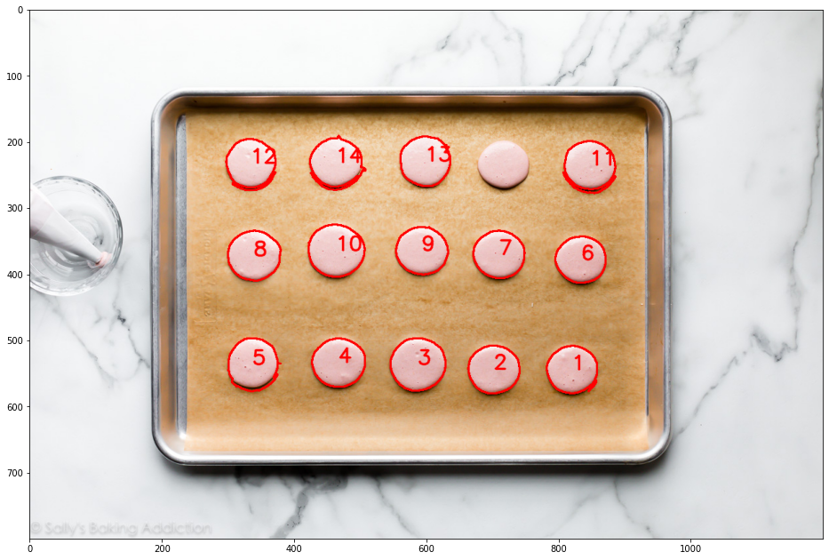
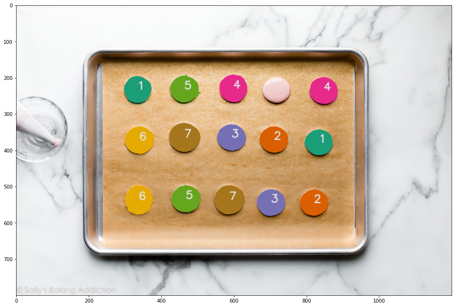

# macaron-match

One of the key steps in baking macarons is to match top and bottom shells to each other, usually with a lot of guesswork. If you are good at piping, the shells should be fairly consistent in size and shape and therefore easy to match.

I am not good at piping.

## Overview

1. Take an overhead picture of all shells.
2. Extract the shell contours using Canny edge detection
    - potentially ResNet-based segmentation model if non-ML solution didn't work
3. Perform at least one matching strategy, in order of complexity:
    - Sort contours by area and assign pairs by order, ignoring shape
    - Cluster into small/large using Jenks on contour area, then within each cluster, assign edges using pairwise contour similarity (`cv2.matchContours()`) and use maximum bipartite matching
    - Instead of clustering, sort contours by area as before, then just have a sliding window of +/- 2-5 contours smaller and larger within which contour similarity edges can be assigned. Smaller window = lower chance small and medium-sized shells with the same shape would be matched
4. Return image showing labeled pairs

## How it works

     
    <i>Input image (<a href="https://newsaxes.com/newbies-information-to-french-macarons-sallys-baking-habit/">source</a>)</i>

     
    <i>Input image with edges extracted using Canny edge detection</i>

     
    <i>After the low-quality edges are filtered out</i>

     
    <i>Simple baseline matches based on contour area</i>

## TODO

- Get some quick performance metrics up (e.g. mean intra-pair contour similarity score for matching, ??? for actual contour detection?)
- Corral experimental notebook code into proper architecture
- Write CLI tool for simpler desktop testing
- Unit tests for components
- Deployment considerations
    - Do I have to rewrite this in Java?
    - Does Kotlin even support OpenCV?
    - Alternatively keep the backend in Python, slap an API on it, self-host, then write a barebones JS webapp to make requests that I can submit from my phone. No custom app to access camera functionality necessary; can just look in device's image folders for now.
